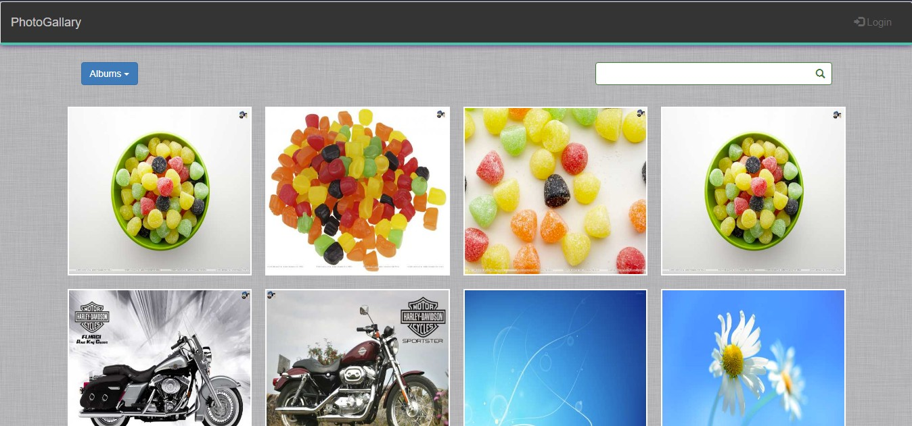

# Photo Gallery - Laravel5 Project

A simple photo gallery project.

## Instruction:

<!-- Common for most of the project -->
<!-- <ul>
    <li>Creating a Database 'laravel_photoGallary' in your database server.</li>
    <li>composer update</li>
    <li>'npm install' and then 'npm run dev'</li>
    <li>php artisan storage:link</li>
    <li>copy the file .env.sample and rename into .env, then give information by following instruction such as app_url, database, hosting server, mail information.</li>
    <li>create app key by 'php artisan key:gen'</li>
    <li>php artisan migrate</li>
    <li>php artisan serve</li>
</ul> -->

<ul>
    <li>Creating a Database 'laravel_photoGallary' in your database server.</li>
    <li>composer update</li>
    <li>'npm install' and then 'npm run dev'</li>
    <li>copy the file .env.sample and rename into .env, then give information by following instruction such as app_url, database, hosting server, mail information.</li>
    <li>create app key by 'php artisan key:gen'</li>
    <li>php artisan migrate</li>
    <li>php artisan serve</li> 
    <li>Register a user</li> 
    <li>Reset from dashboard (if you can use it freshly)</li> 
    <li>Again register</li>
    <li>Now, create Album and upload images.</li> 
</ul>

### Project Version:

1.2.4 (19-Feb-2023)

### Start Date:

29-Dec-2017

### Developed by:

Md. Rezwan Saki Alin
https://www.alinsworld.com/

### Used:

<ul>
 <li>Php7</li>
 <li>Laravel 5.5</li>
 <li>Localhost (Wamp Server)</li>
 <li>Bootstrap 3.3.7, Html5, CSS3</li>
</ul>

## License

The Laravel framework is open-sourced software licensed under the [MIT license](https://opensource.org/licenses/MIT).
